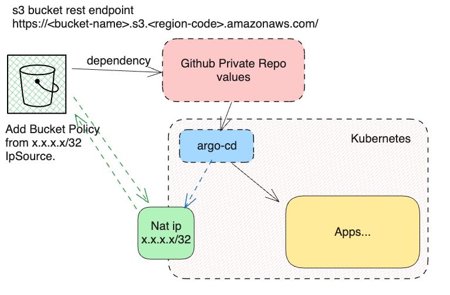

### Demo argocd use private s3 bucket access from ip whitelist.
```bash
kubectl create -n argocd -f https://raw.githubusercontent.com/argoproj/argo-cd/stable/manifests/install.yaml
```




### Clean up
```bash
kubectl delete -n argocd -f https://raw.githubusercontent.com/argoproj/argo-cd/stable/manifests/install.yaml
```
